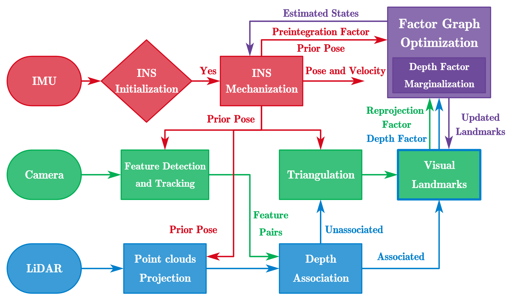

## LE-VINS: INS-Centric Visual-Inertial Navigation System With LiDAR Enhancement



This repository provides a modified version of [IC-GVINS](https://github.com/i2Nav-WHU/IC-GVINS) that supports pure VINS. Besides, we also implement the LiDAR-enhanced method in [LE-VINS](https://ieeexplore.ieee.org/document/10078292/) into this repository.

**Authors:** Hailiang Tang, Xiaoji Niu, and Tisheng Zhang from the [Integrated and Intelligent Navigation (i2Nav) Group](http://www.i2nav.com/), Wuhan University.

**Related Paper:**

- Hailiang Tang, Tisheng Zhang, Xiaoji Niu, Liqiang Wang, and Jingnan Liu, "LE-VINS: A Robust Solid-State-LiDAR-Enhanced Visual-Inertial Navigation System for Low-Speed Robots," *IEEE Transactions on Instrumentation and Measurement*, 2023.
- Xiaoji Niu, Hailiang Tang, Tisheng Zhang, Jing Fan, and Jingnan Liu, “IC-GVINS: A Robust, Real-time, INS-Centric GNSS-Visual-Inertial Navigation System,” *IEEE Robotics and Automation Letters*, 2023.
- Hailiang Tang, Tisheng Zhang, Xiaoji Niu, Jing Fan, and Jingnan Liu, “Impact of the Earth Rotation Compensation on MEMS-IMU Preintegration of Factor Graph Optimization,” *IEEE Sensors Journal*, 2022.

**Contacts:**

- For any technique problem, you can send an email to Dr. Hailiang Tang (thl@whu.edu.cn).
- For Chinese users, we also provide a QQ group (481173293) for discussion. You are required to provide your organization and name.

## 1 Prerequisites

### 1.1 System and compiler

We recommend you use Ubuntu 18.04 or Ubuntu 20.04 with the newest compiler (**gcc>=8.0 or clang>=6.0**).

```shell
# gcc-8
sudo apt install gcc-8 g++-8

# Clang
# sudo apt install clang
```

### 1.2 Robot Operating System (ROS)

Follow [ROS Melodic installation instructions for Ubuntu 18.04](https://wiki.ros.org/melodic/Installation/Ubuntu) and [ROS Noetic installation instructions for Ubuntu 20.04](http://wiki.ros.org/noetic/Installation/Ubuntu).

### 1.3 OpenCV

The supported version is **OpenCV (>=3.2.0)**. You can install OpenCV from your system repository or build from the source code. OpenCV 4 is also supported.

### 1.4 oneTBB

Threading Building Blocks (TBB) are used for parallel processing. We recommend you use [oneTBB](https://github.com/oneapi-src/oneTBB), and install the latest released version. You should install oneTBB before Ceres Solver.

### 1.5 Ceres Solver with its Dependencies

We use **Ceres Solver (>=2.1.0)** to solve the non-linear least squares problem. Please follow [Ceres installation instructions](http://ceres-solver.org/installation.html).

The dependencies **Eigen (>=3.3.7)**, **glog (>=0.4.0)** are also used. You can install them as follows:

```shell
sudo apt install libeigen3-dev libgoogle-glog-dev
```

### 1.6 yaml-cpp

The yaml-cpp is employed for reading configurations. It can be installed as:

```shell
sudo apt install libyaml-cpp-dev
```

## 2 Build and run LE-VINS

### 2.1 Build the source code

```shell
# Make workspace directory
mkdir ~/workspace && cd ~/workspace
mkdir src && cd src

# Clone the repository into src directory
git clone https://github.com/i2Nav-WHU/LE-VINS.git

# To workspace directory
cd ..

# Build the source code using catkin_make
catkin_make -j8 -DCMAKE_BUILD_TYPE=Release -DCMAKE_C_COMPILER=gcc-8 -DCMAKE_CXX_COMPILER=g++-8
```

### 2.2 Run demo dataset

If you have already downloaded the open-sourced dataset, run the following commands.

```shell
# Open a terminal and source the workspace environments
# For bash
source ~/workspace/devel/setup.bash
# For zsh
# source ~/workspace/devel/setup.zsh

# Run LE-VINS node
# 1. Download the dataset.
# 2. Modify the configurations in le_vins.yaml.
# 3. Change the path in the follwoing command.
# 4. Run the follwoing command.
roslaunch le_vins le_vins_read.launch configfile:=path/le_vins.yaml bagfile:=path/rosbag.bag
```

## 3 Datasets

### 3.1 Format

Please be careful the following notes:

- The IMU should be in the **front-right-down** format in LE-VINS.
- We support **Livox, Velodyne, and Ouster** LiDARs, but they should in correct formats.
- **CompressedImage** messages is also support, and you can enable it by modifying the configuration file.

### 3.2 IC-GVINS Robot Dataset

You can run LE-VINS in visual-inertial mode using the open-sourced [IC-GVINS](https://github.com/i2Nav-WHU/IC-GVINS) dataset.

### 3.3 R3LIVE Handheld Dataset

The [R3LIVE](https://github.com/ziv-lin/r3live_dataset) dataset is supported. However, you should be careful about the following issues:

- You should change the IMU data into the **front-right-down** format.
- The image message is with CompressedImage format.
- The camera and IMU are not well synchronized, and the initial time-delay parameter is every large in some sequences. We have provided the initial time-delay parameters for each sequence in the configuration file.

### 3.4 FusionPortableV2 Vehicle Dataset

The [FusionPortableV2](https://fusionportable.github.io/dataset/fusionportable_v2/) dataset is supported, and the vehicle sequences have been fully tested. The STIM-300 IMU, the left camera, and the Ouster LiDAR are employed.

- You should change the IMU data into the **front-right-down** format.
- The sensors are not well synchronized. The time-delay parameter for camera-IMU can be estimated online in LE-VINS, while the time-delay parameter for LiDAR-IMU are not estimated. Hence, you should modify the time-delay parameter of LiDAR-IMU for each sequences in the configuration file.

### 3.5 Your own dataset

You can run LE-VINS with your self-collected dataset. Keep in mind the following notes:

1. You should prepare dataset in a ROS bag
2. The IMU data should be in the **front-right-down** format
3. Modify the topic names in the configuration file
4. Modify the parameters in the configuration file

### 3.6 Evaluation

We use [evo](https://github.com/MichaelGrupp/evo) to evaluate the TUM trajectory files. We also provide some useful scripts ([evaluate_odometry](https://github.com/i2Nav-WHU/evaluate_odometry)) for evaluation.

## 4 Acknowledgements

We thanks the following projects for the helps in developing and evaluating the LE-VINS:

* [IC-GVINS](https://github.com/i2Nav-WHU/IC-GVINS): A Robust, Real-time, INS-Centric GNSS-Visual-Inertial Navigation System
* [VINS-Fusion](https://github.com/HKUST-Aerial-Robotics/VINS-Fusion): An optimization-based multi-sensor state estimator
* [OB_GINS](https://github.com/i2Nav-WHU/OB_GINS): An Optimization-Based GNSS/INS Integrated Navigation System
* [evo](https://github.com/MichaelGrupp/evo): Python package for the evaluation of odometry and SLAM

## 5 License

The source code is released under GPLv3 license.

We are still working on improving the codes. For any technical issues, please contact Dr. Hailiang Tang ([thl@whu.edu.cn](mailto:thl@whu.edu.cn)) or open an issue at this repository.

For commercial usage, please contact Prof. Xiaoji Niu ([xjniu@whu.edu.cn](mailto:xjniu@whu.edu.cn)).
